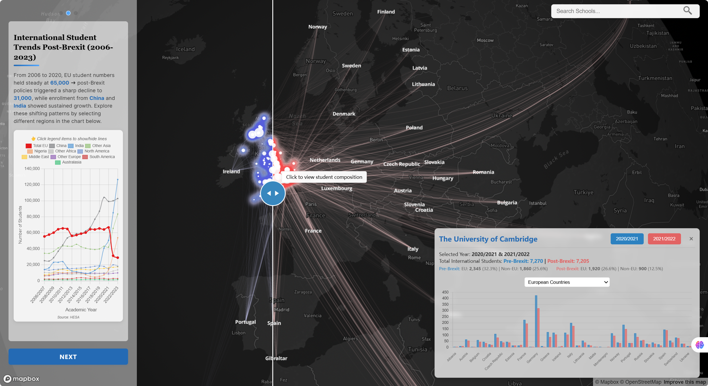

# Brexit and UK Education: A Visualization of International Student Trends

This repository contains visualisation tools for analyzing the impact of Brexit on international student migration to UK universities. The project utilizes HESA data and incorporates various technologies, including Python for data preparation, Mapbox GL JS for base mapping, and D3.js for dynamic visualisations.  

- **Interactive Maps**: Visualise trends in student demographics.  
- **Comparison Tool**: Analyze student numbers before and after Brexit.  
- **Search Functionality**: Find specific institutions with detailed insights.  

## Data Sources  
- HESA data from: [Where do HE students come from? | HESA](https://www.hesa.ac.uk/data-and-analysis/students/where-from).  
- Comparison plugin sourced from: [Mapbox GL Compare](https://github.com/mapbox/mapbox-gl-compare).

## 🌐 Online Exploration  
Access the interactive visualisation [here](https://verali0710.github.io/03Viz-Brexit-Edu/).  

  
